### ALERT APP FRONTEND

Link to backend: https://github.com/barteknat/alert-app-backend

ALERT APP allows you to:

-> check actual air pollution and weather in selected Poland cities - for every user,

-> subscribe on getting alert e-mails about bad air condition in chosen city when it occurs - only for registered users after logging in.

#### RUN INSTRUCTION

To run application, clone backend (link above) and this frontend code from GitHub and:

For backend (runs first):
- open project and set local MySQL database and database user according to application.properties
- for enable sending alert e-mails of subscribed cities:
  
  -> set your gmail logIn and password in application.properties
  
  -> enable less secure apps to access your gmail account
- build the project
- start the application by running main method in AlertApplication class (app is using local server 8080)

For frontend (runs second):
- open and build the project
- start the application by running main method in AlertFrontApplication class (app is using local server 8081)
- open your browser on localhost:8081

#### THE QUICK GUIDE ABOUT THE FRONT

This is the main page of ALERT APP. You can check info about the app at the top bar, or try to get details about air condition and weather from selected city. You can also create a new account, or logIn to the app if you are already registered. 
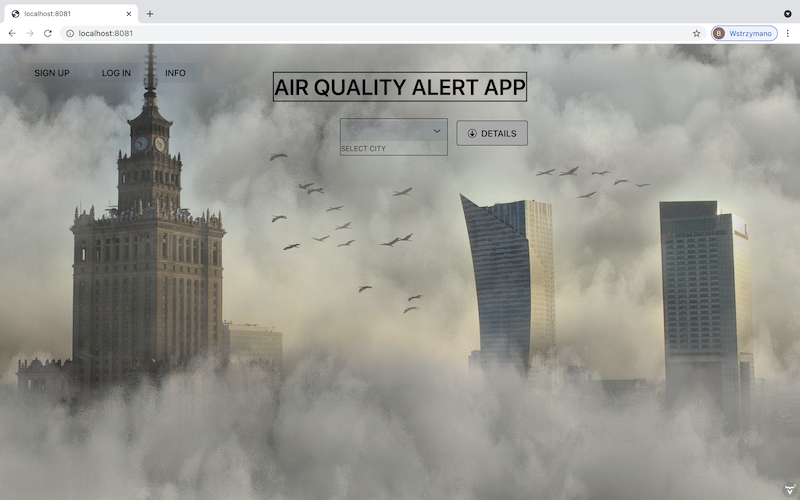
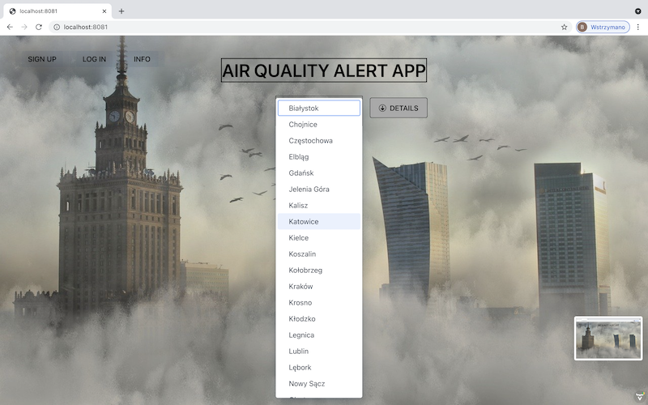
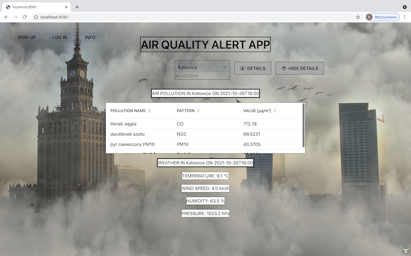
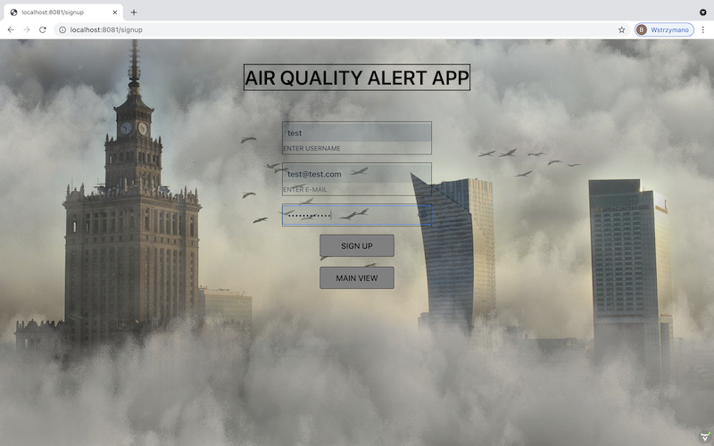
Now you can click logIn at the menu bar.
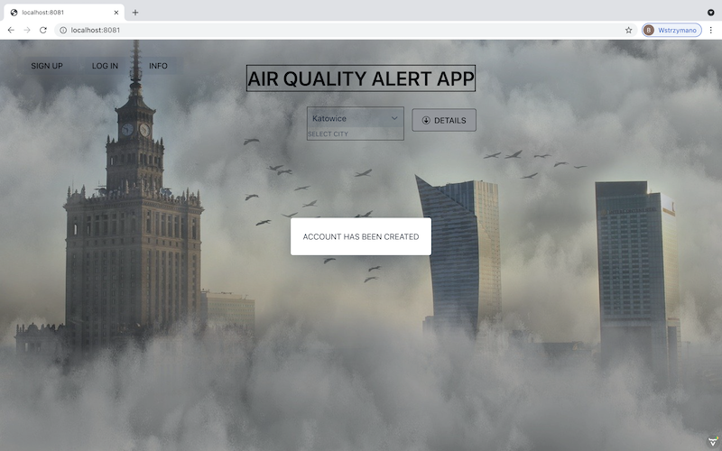
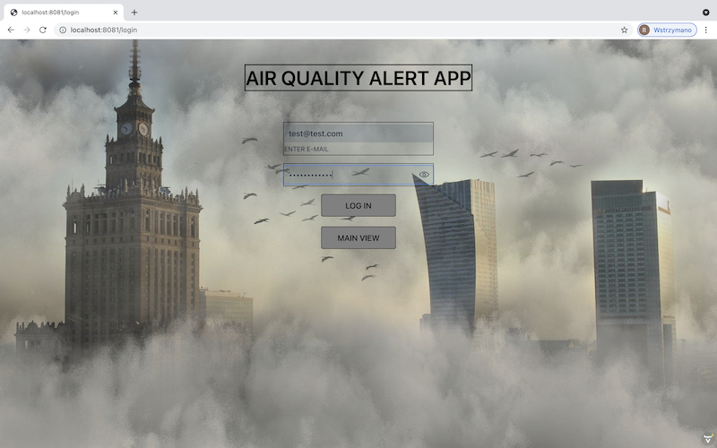
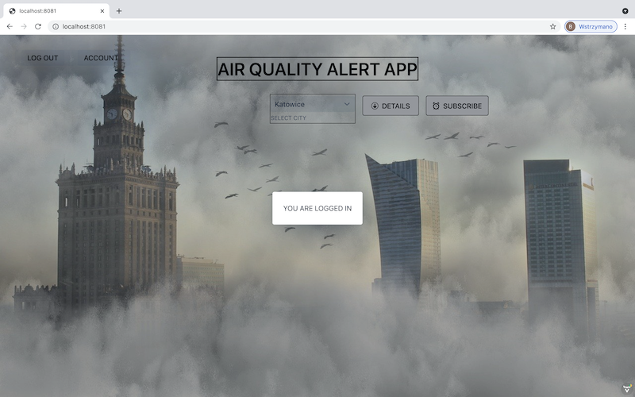
If you are signed up and logged in, you can use a new button occurred -> SUBSCRIBE, which clicked, gives you an e-mail alert about actual bad air condition at subscribed city.
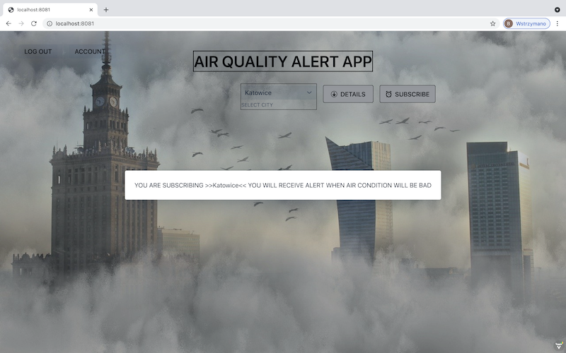
You can manage your subscriptions at your account, or you can just update your sign up details:
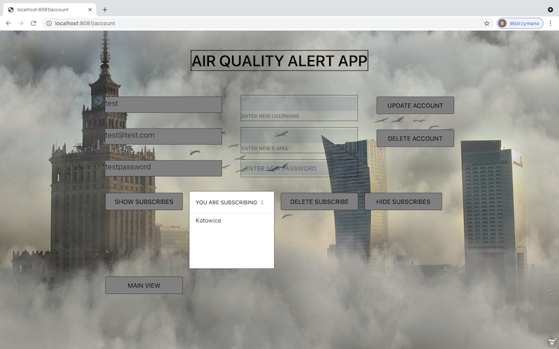
Furthermore, if you get back to the logIn panel and type ADMIN as user and ADMINPASSWORD as password, you will get an access to the statistics panel of the application
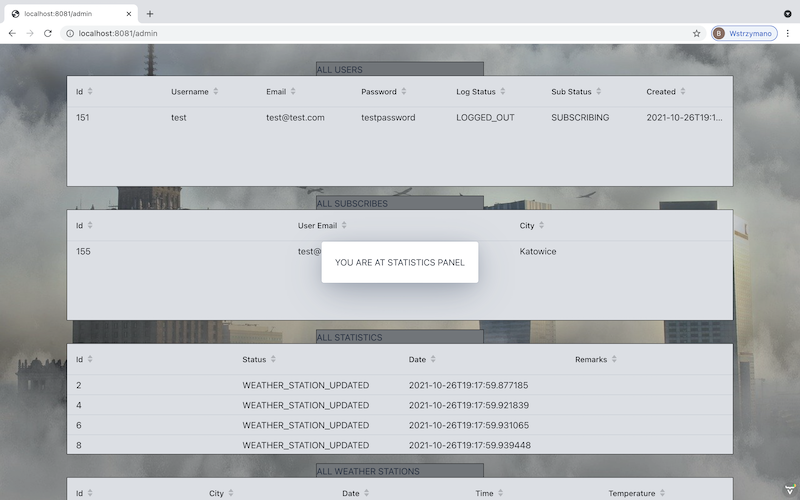
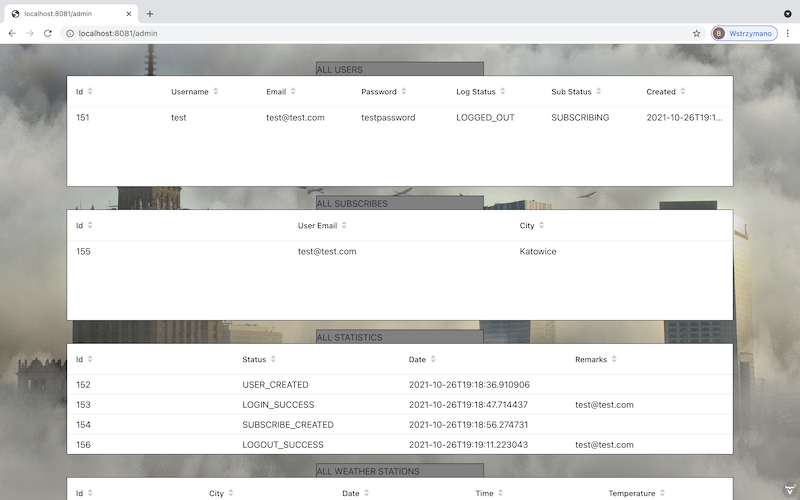
At last you can delete account by commiting deletion button.

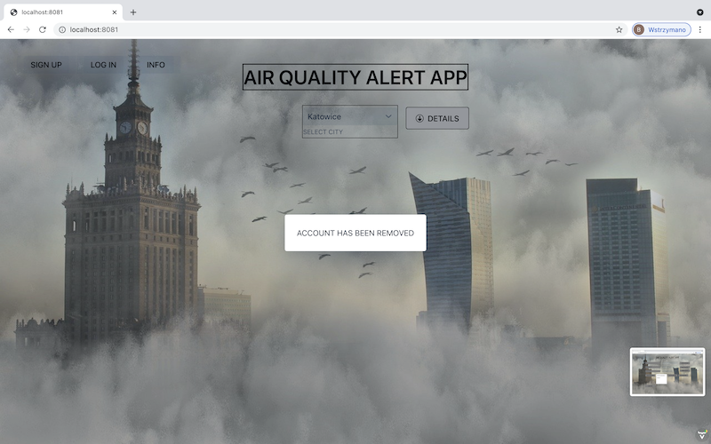

Used API:

https://powietrze.gios.gov.pl/pjp/content/api

https://danepubliczne.imgw.pl/apiinfo

The data from APIs is changed or incomplete.

Used photo:

https://pixabay.com/pl/photos/mati-miasto-architektura-budynek-3131158/
